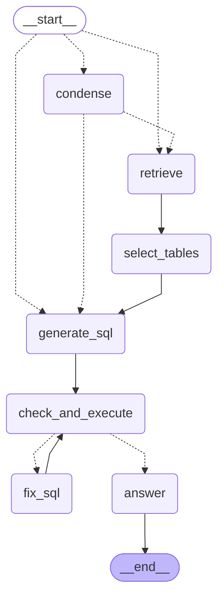

# Online LangGraph

The start edge chooses between retrieval and SQL generation. Supplying `tables_override` bypasses `retrieve` and `select_tables`; failed SQL routes through `fix_sql` until it succeeds or the retry limit is reached.
